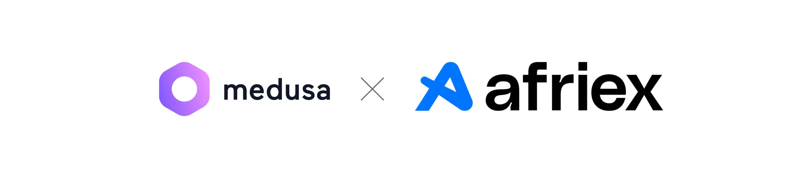

# medusa-payment-afriex

<p dir="auto"><a target="_blank" rel="noopener noreferrer nofollow" href="./medusa-afriex-plugin.png"></a></p>

A Medusa v2 payment provider that lets a storefront collect payment through
Afriex's bank rails — a **dedicated virtual account** minted per order, or a
standing **pool account** the shopper quotes a reference against. Deposits are
confirmed by webhook, and the order is completed from that webhook alone.

Built on [`@afriex/sdk`](https://www.npmjs.com/package/@afriex/sdk), which is a
regular dependency and is never vendored — the installing project's version wins.

---

## How the payment actually flows

Afriex bank collection is asynchronous. Nothing at checkout can tell you whether
the shopper will complete the transfer, so the plugin does not pretend otherwise:

1. **Checkout** — the shopper picks Afriex. `initiatePayment` creates the
   account they will pay into and returns the details for the storefront to
   render. The session sits at `pending`.
2. **Place order** — the shopper can complete the cart before paying. The
   provider returns `pending_authorization`, so Medusa creates the order in an
   awaiting-payment state instead of blocking checkout on money that has not
   moved yet.
3. **Transfer lands** — Afriex sends `TRANSACTION.UPDATED`. The plugin verifies
   the signature, checks the amount, and asks Medusa to authorize, capture, and
   complete the cart.

The webhook is the only thing that can mark an order paid. There is no "I have
paid" button, no polling from the storefront, and no path where a shopper's
claim moves payment state.

---

## Install

```bash
npm install @afriex/medusa-payment-provider
```

Requires Medusa `>= 2.21`, Node `>= 20.19`, and Postgres.

> **Node floor.** `@afriex/sdk` ships as ESM and this plugin compiles to
> CommonJS, so it relies on Node's `require(esm)` support — unflagged in Node
> 20.19 and 22.12. Older Node will fail at load time.

### 1. Register the plugin and the provider

```ts
// medusa-config.ts
module.exports = defineConfig({
  plugins: ["@afriex/medusa-payment-provider"],
  modules: [
    {
      resolve: "@medusajs/payment",
      options: {
        providers: [
          {
            resolve: "@afriex/medusa-payment-provider/providers/afriex-payment",
            id: "afriex",
            options: {
              apiKey: process.env.AFRIEX_API_KEY,
              environment: process.env.AFRIEX_ENVIRONMENT, // "staging" | "production"
              webhookPublicKey: process.env.AFRIEX_WEBHOOK_PUBLIC_KEY,
              collectionMethod:
                process.env.AFRIEX_COLLECTION_METHOD ?? "dedicated",
              defaultCountryCode: "NG",
            },
          },
        ],
      },
    },
  ],
});
```

Registering the plugin is what brings in the webhook route, the admin widget,
and the table behind webhook idempotency. Registering only the provider gives
you the payment methods without any of those.

`apiKey` and `webhookPublicKey` are both required — the provider refuses to
start without them, because a provider that cannot verify a signature can never
safely confirm an order.

### 2. Run the migration

```bash
npx medusa db:migrate
```

This creates `afriex_processed_webhook`, a single table in your own Medusa
database. The plugin deliberately does not ask you to run Redis or any separate
service just to deduplicate webhook deliveries.

### 3. Point Afriex at the webhook

Register **one** URL in the Afriex dashboard:

```
https://your-store.com/afriex/webhook
```

Medusa's generic `/hooks/payment/pp_afriex_afriex` endpoint also works, but it
skips this plugin's idempotency store and its amount-mismatch review. Register
one or the other, never both.

---

## Collection methods

|                            | `dedicated`                                                    | `pool`                                      |
| -------------------------- | -------------------------------------------------------------- | ------------------------------------------- |
| Account                    | One virtual account per order, scoped to the exact total       | One standing account for the country        |
| Shopper quotes a reference | No                                                             | **Yes — required**                          |
| Expires                    | Yes, shortly after creation                                    | No                                          |
| Best for                   | Lower volume, where a wrong reference is the main failure mode | High volume, or shoppers who pay repeatedly |
| Afriex customer created    | Yes, reused when Medusa already has one                        | No                                          |

Both endpoints are production-only at Afriex, so neither can be exercised
end-to-end in the sandbox.

### What the storefront receives

`payment_session.data.instructions` is plain data, not markup — render it to fit
your theme:

```jsonc
{
  "bankName": "Providus Bank",
  "accountNumber": "0123456789",
  "accountName": "Afriex / Order",
  "reference": "payses_01J...", // pool only
  "note": "Include the reference exactly as shown when making your transfer.",
  "expiresNote": "..." // dedicated only
}
```

---

## How a deposit is matched to an order

The Medusa payment session id is set as the Afriex `reference` when the account
is created, and Afriex echoes it back on every transaction. That one thread is
how a deposit finds its cart.

An event with no reference, or one naming a session this store does not have, is
acknowledged and otherwise ignored. It is never applied to a best-guess order.

## When the amount does not match

A settled deposit whose amount or currency differs from the session — under, over,
or in the wrong currency — is **not** captured. The session is moved to
`requires_more`, the discrepancy is written to the session data and the log, and
the order waits for a human. The admin widget on the order page shows what was
expected against what arrived.

## Status mapping

| Afriex                                                                         | Medusa session  | Effect                                                |
| ------------------------------------------------------------------------------ | --------------- | ----------------------------------------------------- |
| `PENDING`, `PROCESSING`, `RETRY`, `SCHEDULED`                                  | `pending`       | Recorded; an in-flight session's status is left alone |
| `SUCCESS`                                                                      | `captured`      | Authorized, captured, cart completed                  |
| `FAILED`, `REJECTED`                                                           | `error`         | Recorded, order left unpaid                           |
| `CANCELLED`                                                                    | `canceled`      | Recorded                                              |
| `IN_REVIEW`, `CUSTOMER_ACTION_REQUIRED`, `REFUNDED`, `UNKNOWN`, any `DISPUTE*` | `requires_more` | Flagged for a human                                   |
| anything unrecognised                                                          | `pending`       | Never confirms, never fails                           |

---

## Limitations in v1

- **No refunds.** `refundPayment` throws rather than silently succeeding. Refund
  out of band and record it manually.
- **Collection endpoints are production-only.** The full initiate → webhook →
  capture path cannot be verified in the Afriex sandbox.
- **Amounts are sent in major units** (`25000` meaning ₦25,000), matching
  `transactions.create`. Confirm this against your own Afriex account before
  going live with real money.

## Deployment checklist

- [ ] Plugin and provider both registered in `medusa-config.ts`
- [ ] `AFRIEX_API_KEY` and `AFRIEX_WEBHOOK_PUBLIC_KEY` set
- [ ] `npx medusa db:migrate` run
- [ ] Collection method chosen for your volume and repeat rate
- [ ] Exactly one webhook URL registered with Afriex
- [ ] Account creation confirmed against your real target countries
- [ ] One live order run end to end before taking real customers

## Development

```bash
pnpm install
pnpm test        # vitest
pnpm typecheck   # tsc --noEmit
pnpm build       # medusa plugin:build
```

Tests cover the invariants that matter rather than that functions return:
one capture per deposit however many times it is delivered, no auto-capture on a
mismatch, nothing read or written before a signature verifies, and a failed
reconciliation releasing its idempotency claim so the retry still lands.

## License

MIT
