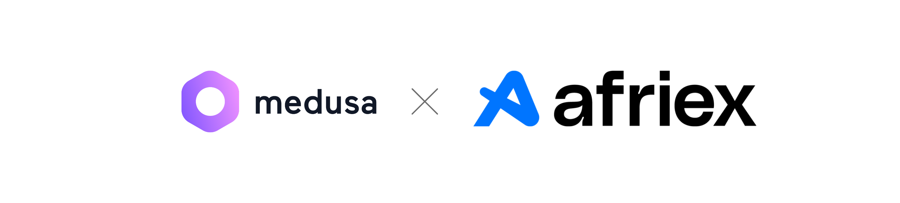
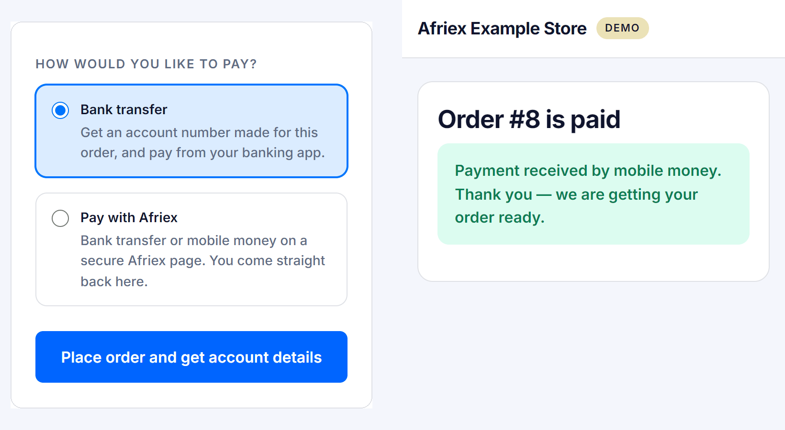

# medusa-payment-afriex

Get paid in a [Medusa](https://medusajs.com) v2 store with
[Afriex](https://www.afriex.com), by **bank transfer** (a bank account number
shown at checkout) or through **Afriex Checkout** (a hosted Afriex page for
mobile money and bank transfer). Either way, a verified Afriex webhook marks the
order paid when the money lands. Each method is turned on or off per region.

<p></p>

> **Want to use the plugin in your store?** Everything you need is in
> **[`packages/plugin/README.md`](./packages/plugin/README.md)**: getting your
> Afriex keys, seven setup steps, options, and troubleshooting.
>
> This page is for running the example store and working on the plugin itself.

## What is in this repository

This is a pnpm workspace.

```
packages/
  plugin/             medusa-payment-afriex, the package published to npm
examples/
  medusa-backend/     a Medusa store that loads the plugin straight from this workspace
  storefront/         a small React Router shop that walks one cart through checkout
scripts/
  afriex-webhook.mjs        signs and sends test webhooks, so you can pay orders locally for free
  afriex-checkout-e2e.mjs   walks an Afriex Checkout order through the store API
docs/
  checkout-sessions-plan.md the design and milestones for Afriex Checkout
  knowledge-graph/          a map of the codebase: one file per feature, how to run and test it
```

The examples sit outside `packages/` on purpose. They are private apps that use
the plugin exactly the way an installing project would, and they are never published.

| Read this | When you want to |
| --- | --- |
| [`packages/plugin/README.md`](./packages/plugin/README.md) | Install and configure the plugin in your own store |
| [`examples/medusa-backend/README.md`](./examples/medusa-backend/README.md) | Understand the example store, its seed data, and webhook tunnelling |
| [`examples/storefront/README.md`](./examples/storefront/README.md) | See what the shopper sees, and lift checkout code from it |

## Requirements

- Node **20.19 or newer**, and [pnpm](https://pnpm.io)
- Postgres. `pnpm db:up` in the example backend starts one with Docker.
- An Afriex API key and webhook public key. See
  [Step 1 of the plugin README](./packages/plugin/README.md#step-1-get-your-two-afriex-keys).

## Run the example store

<p><br><sub>What the example gives you: a checkout that offers each Afriex method, and an order that turns paid when Afriex's webhook lands.</sub></p>

From a fresh clone to a storefront you can check out in.

**1. Install and build the plugin.** Medusa loads the plugin from its built
output, so it has to be built before the backend starts.

```bash
pnpm install
pnpm plugin:build
```

**2. Start the backend.**

```bash
cd examples/medusa-backend
cp .env.template .env     # then fill in the three AFRIEX_* values
pnpm db:up                # Postgres in Docker. Skip if DATABASE_URL points at your own.
pnpm db:migrate           # also creates the plugin's tables
pnpm seed                 # prints a publishable key. Copy it.
pnpm dev                  # http://localhost:9000, admin at /app
```

Create an admin user with `npx medusa user -e admin@example.com -p supersecret`.

**3. Start the storefront**, in a second terminal.

```bash
cd examples/storefront
cp .env.template .env     # paste the publishable key from `pnpm seed`
pnpm dev                  # http://localhost:8000
```

✅ **You should see:** the seeded product at http://localhost:8000. Buying it
takes you through an address form to an order page showing a bank account to
pay into, which waits for the payment.

**If checkout says "Afriex payment initiation failed":** you are almost certainly
on staging keys. Afriex only creates virtual accounts in **production**. The
server and the webhook route work fine on staging, but no account can be created,
so checkout stops there. Use a production API key with
`AFRIEX_ENVIRONMENT=production` to get past it. Creating a virtual account is
real, but it moves no money. The actual Afriex error is in the backend log.

## Testing without real money

A real test needs a real bank transfer. To test everything on the Medusa side
without one, you can play Afriex's part yourself.

Afriex signs each webhook with its private key, and the plugin trusts only what
verifies against the public key in its config. You cannot forge Afriex's
signature. So you swap roles: generate your own key pair, give the plugin *your*
public key, and sign test events with your private key.

**1. Generate a throwaway key pair.**

```bash
pnpm webhook:keygen
```

It prints an `AFRIEX_WEBHOOK_PUBLIC_KEY="..."` line. Put it in
`examples/medusa-backend/.env` in place of the real key, and **restart the
backend**, which reads its options once at boot. The private key stays in
`.afriex-dev/`, which is git-ignored.

**2. Create an order to pay.** Check out in the storefront until you reach the
order page with the bank details. Then list the payment sessions:

```bash
cd examples/medusa-backend
pnpm afriex:sessions
```

It prints each session's id, expected amount, and account id, plus a ready-made
command for the newest one.

**3. Pay it.** From the repository root:

```bash
pnpm webhook:send --session payses_01J... --amount 25000
```

✅ **You should see:** `HTTP 200` with `"outcome":"captured"`, the storefront's
order page flip to paid within five seconds, and the Afriex widget on the order
in the admin showing the transaction.

**Now break it on purpose.** Each of these is a case the plugin handles. Start a
fresh order for each one, unless it says otherwise.

| Try this | Command | Expect |
| --- | --- | --- |
| Underpayment | `--session X --amount 20000` | `amount_mismatch`. Not captured. The widget shows expected against received. |
| Wrong currency | `--session X --amount 25000 --currency GHS` | `amount_mismatch` |
| Afriex redelivers | `--session X --amount 25000 --transaction txn_1 --repeat 3` | `captured` once, then `duplicate` twice |
| Shopper pays twice | pay the order, then send the same command again | `extra_deposit`. The widget lists it as needing a refund. |
| Underpays, then corrects | `--amount 20000`, then `--amount 25000`, same session | `amount_mismatch`, then `captured`. The first transfer is kept as an extra deposit. |
| In review, then settles | `--transaction txn_1 --status IN_REVIEW`, then the same without `--status` | `status_recorded`, then `captured` |
| Late event after payment | pay the order, then `--transaction <same id> --status PROCESSING` | `status_recorded`. The order stays paid. |
| Forged request | `--session X --amount 25000 --bad-signature` | `HTTP 401`. Nothing is read or written. |
| Reference lost in transit | `--no-reference --account <account id> --amount 25000` | `captured`, matched by the account instead |
| Unknown order | `--session payses_nope --amount 100` | `unknown_session`, and an error-level log line because the deposit had settled |

`pnpm webhook:send --dry-run ...` prints the payload and signature without
sending, and `node scripts/afriex-webhook.mjs help` lists every option. The
script has no dependencies, so you can copy it into any project.

### Afriex Checkout

Set `AFRIEX_CHECKOUT_RETURN_URL` in `examples/medusa-backend/.env` (any HTTPS
URL works for this test) and restart the backend. The seed turns both methods
on in its region. Then, from the repository root:

```bash
pnpm checkout:e2e --publishable-key pk_...
```

It builds a cart, chooses Afriex Checkout, places the order, and asks for the
payment link, printing each step. With working Afriex keys it prints the link
and a ready-made simulator command. If Afriex refuses, it prints the `code` your
storefront would get, and the order is left waiting for another try. Once a
link exists, pay it with the simulator, using the amount the script printed:

| Try this | Command | Expect |
| --- | --- | --- |
| Paid by mobile money | `--session X --amount 25000 --channel MOBILE_MONEY` | `captured` |
| Failed, then paid | `--status FAILED --failure-message "Insufficient funds" --transaction t1`, then pay | `status_recorded`, then `captured`. The widget keeps the failure. |
| Waiting on the shopper's phone | `--status CUSTOMER_ACTION_REQUIRED --otp-required` | `status_recorded`, and the order stays pending, not flagged |
| Paid twice | pay, then pay again with a new `--transaction` | `extra_deposit` |

A second "Pay now" while the link is open is refused with
`AFRIEX_PAYMENT_IN_PROGRESS`, and the open link is sent back.

> ⚠️ **Local use only.** Anyone holding `.afriex-dev/webhook-private.pem` can mark
> orders paid on any server configured with its public key. Never deploy that
> public key. Put Afriex's real key back before you go near production. While
> the throwaway key is in place, genuine Afriex webhooks are rejected with a
> `401`, which is expected.

To check the other direction, that Afriex can reach your machine and that your
*real* public key is right, see
[Testing in the plugin README](./packages/plugin/README.md#testing).

## Working on the plugin

```bash
pnpm install          # every workspace at once
pnpm build            # turbo: the plugin first, then anything depending on it
pnpm test             # vitest
pnpm typecheck
```

| Command | What it does |
| --- | --- |
| `pnpm plugin:build` | One build of the plugin into `packages/plugin/.medusa/server` |
| `pnpm plugin:dev` | Rebuilds the plugin whenever you save |
| `pnpm backend:dev` | Runs the example backend |
| `pnpm storefront:dev` | Runs the example storefront |
| `pnpm --filter medusa-payment-afriex test` | The plugin's tests only |
| `pnpm webhook:keygen`, `pnpm webhook:send` | The webhook simulator |
| `pnpm checkout:e2e --publishable-key pk_...` | An Afriex Checkout order through the store API |

**Restart the backend after the plugin rebuilds.** The examples depend on
`"medusa-payment-afriex": "workspace:*"`, which pnpm links to the local package,
and Medusa loads it from the built output. `medusa develop` watches the backend's
own `src/`, not the linked plugin, so a rebuild does not reload the running server.

A comfortable loop is three terminals: `pnpm plugin:dev`, the backend, and the
storefront.

### Where things are

```
packages/plugin/src/
  providers/afriex-payment/
    base.ts                    shared by both providers: options, status, webhook verification
    bank-transfer-service.ts   pp_afriex_afriex: virtual accounts and customers
    checkout-service.ts        pp_afriex-checkout_afriex: payment links
  lib/webhook-handler.ts       the only path by which Afriex changes payment state
  lib/payment-session-guard.ts the middleware in front of every new payment session
  lib/reconciliation.ts        the per-order lock, status writes, capture
  lib/held-payments.ts         settling held money (apply, resolve)
  lib/region-methods.ts        per-region on/off switches
  api/                         the webhook route, admin routes, middlewares
  modules/                     processed webhooks; the reference ledger and settlements
  subscribers/, jobs/          ledger writes; nightly pruning
  admin/widgets/               the order and region page widgets
```

[`docs/knowledge-graph/`](./docs/knowledge-graph/) maps every feature to its files and tests.

### What the tests protect

The tests check behaviour that would cost money if it broke, rather than that
functions return:

- one capture per deposit, however many times Afriex delivers it
- no capture on a wrong amount or currency
- nothing read or written before the signature verifies
- a settled order never un-paid by a late progress event
- a second deposit recorded, never silently dropped
- a failed reconciliation releasing its claim, so the retry still lands
- a lookup failure answered with `500`, never mistaken for "unknown order"

They mock Medusa and the Afriex SDK. They do not prove the live Afriex flow,
which can only run in production. The simulator above covers the Medusa half
for real. One small live order covers the rest.

## Roadmap

- **Refunds** from the Medusa admin.
- **Closing a virtual account as soon as it is paid**, so a second transfer
  bounces at the bank instead of arriving as an extra deposit.

## Releasing

Versions go through [changesets](https://github.com/changesets/changesets).
Only `packages/*` is published. The examples are private.

```bash
pnpm changeset          # describe the change and pick a bump
pnpm version-packages   # apply the bumps and write the changelog
pnpm release            # build packages/* and publish to npm
```

For a pre-release that people must opt in to:

```bash
cd packages/plugin
npm version 0.1.0-beta.0 --no-git-tag-version
npm publish --tag beta
```

Before any release, run `pnpm test`, `pnpm typecheck`, and `pnpm plugin:build`,
and check what will ship with `npm pack --dry-run` in `packages/plugin`.

## Contributing

Issues and pull requests are welcome at
[github.com/codewithveek/medusa-payment-afriex](https://github.com/codewithveek/medusa-payment-afriex/issues).
For a bug in payment handling, the most useful report includes the Afriex
transaction status, the outcome the webhook returned, and the matching
error-level log line.

## License

MIT. See [LICENSE](./LICENSE).
